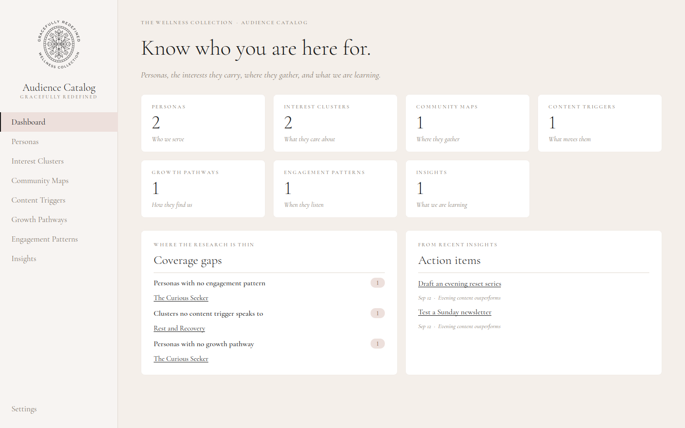
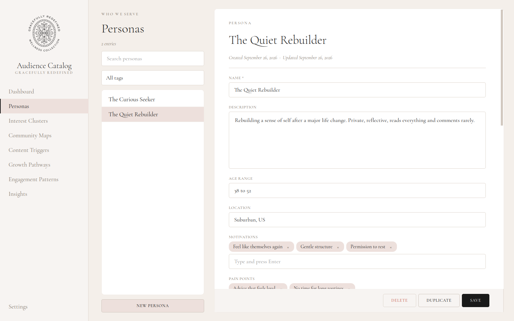

# Audience Catalog

A local desktop app for The Wellness Collection's audience research: personas, the
interests they carry, where they gather, what moves them, how they find us, when they
listen, and what we are learning. It is styled to match the website (Cormorant Garamond,
cream and blush palette, spaced uppercase eyebrows) and keeps all data on your computer.




## Run it

Needs Python 3.10 or newer.

```bash
cd tools/audience-catalog
python -m venv .venv
source .venv/bin/activate          # Windows: .venv\Scripts\activate
pip install -r requirements.txt
python -m audience_catalog --demo  # --demo loads fictional sample data into an empty catalog
```

Options:

| Flag | Effect |
|------|--------|
| `--db PATH` | Open a specific SQLite file instead of the default |
| `--demo` | Load the fictional sample catalog, only if the database is empty |

The catalog lives in your user data folder, **not** in this repo:

| OS | Location |
|----|----------|
| macOS | `~/Library/Application Support/TheWellnessCollection/audience_catalog.sqlite` |
| Windows | `%APPDATA%\TheWellnessCollection\audience_catalog.sqlite` |
| Linux | `~/.local/share/TheWellnessCollection/audience_catalog.sqlite` |

`AUDIENCE_CATALOG_DB` overrides the location. Settings shows the path and offers Back up.

## Phone and web version

The same catalog is available on the website at **`/admin/audience`** (admins only,
mobile-first). It stores entries in the site database and reads and writes the same
JSON format, so you can move data between the two:

- Desktop to site: Settings > Export JSON here, then Data > Import on the site.
- Site to desktop: Data > Export JSON on the site, then Settings > Import here.

Code: `app/admin/audience/`, `app/api/admin/audience/`, `lib/audience.ts` (field
definitions, keep in step with `entities.py`), `lib/audience-server.ts`. Tables:
`AudienceRecord` and `AudienceLink` in `prisma/schema.prisma`.

## Test

```bash
pip install -r requirements-dev.txt
python -m pytest -q
```

The tests cover the data layer, import/export, and a check that `entities.py` and
`schema.sql` agree. They do not drive the UI.

## What it does

- **Seven sections**, each with search, a tag filter, and an editor with Save, Duplicate, Delete.
- **Real relationships.** Pick linked personas, clusters, and triggers from checklists.
  Every record shows what links to it ("Referenced by") and you can jump there.
- **Dashboard** with counts, *coverage gaps* (personas with no cluster, pattern, or
  pathway; clusters no trigger speaks to), and the latest insight action items.
- **Safe editing.** Unsaved-changes prompt when you switch records, pages, or quit.
  Ctrl/Cmd+S saves. Delete warns what else it affects.
- **Import/export.** Versioned JSON (round-trips every field and link), Markdown for
  reading, SQLite backup. Imports are all or nothing: a bad file changes nothing.

## Layout

```
audience_catalog/
  __main__.py        entry point and flags
  entities.py        one declaration per section; drives db, editors, export
  schema.sql         tables, constraints, join tables, indexes
  db.py              all SQL; validation; migrations via PRAGMA user_version
  transfer.py        JSON import/export, Markdown export
  sample.py          fictional demo data
  theme.py           brand tokens (mirrors app/globals.css) and Qt stylesheet
  ui/                main window, generic entity page, dashboard/settings, widgets
  assets/            logo, icon, Cormorant Garamond (SIL OFL 1.1, see fonts/OFL.txt)
tests/
```

To add a field: add it to `entities.py` and `schema.sql`, bump `SCHEMA_VERSION` in
`db.py`, and add an `if version < N:` migration block. `test_schema_sync.py` fails if
the two files drift.

## How this differs from the original spec

See [SPEC_REVIEW.md](SPEC_REVIEW.md) for the full list. The short version: relationships
are real foreign keys instead of text, every table has constraints and timestamps, the
database is kept out of the source tree, one generic editor replaces seven copies, and
the vague parts (Settings, Dashboard, tagging, Duplicate) now have defined behavior.
